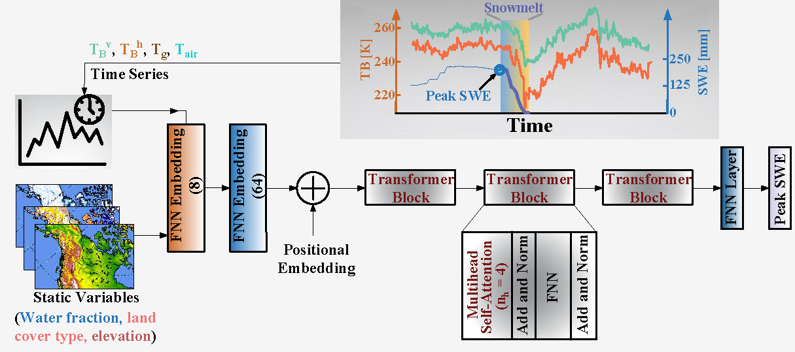

[](https://colab.research.google.com/github/Divak14/SWEFormer/blob/main/Main.ipynb)

# SWEFormer
A transformer-based deep learning architecture to predict the peak Snow water equivalent using L-band brightness temperature observations from NASA's SMAP satellite. 
by Divya Kumawats and Ardeshir Ebtehaj


To run this colab, download the data from here.

```python
import gdown

# Download the dataset from Google Drive
file_id = '1XgHYFKpmK0y7xfXNNdOc87h52_X2qaRS'
url = f'https://drive.google.com/uc?export=download&id={file_id}'
gdown.download(url, 'Training_data_ERA5_datasets.pkl', quiet=False)


file_id = '1EvhE3L65rZslg-C5Tso2KUa6XeWmj2KD'
url = f'https://drive.google.com/uc?export=download&id={file_id}'
gdown.download(url, 'Training_data_insitu_datasets.pkl', quiet=False)
